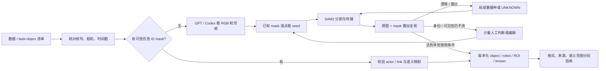

# Robot mask annotation：跨服务器交接

这份仓库把 Astribot 上已经执行过的 **GPT/Codex 视觉复核 → 稀疏 seed → SAM2 传播 → 局部修复 → 版本化验收** 流程交给另一台服务器，用于准备 **RoboTwin** 的 task-relevant object masks。日期：2026-09-19。研究项目为 ACEG4WAM；本仓库只负责标注，不运行策略训练或机器人。

**接手 Codex 先读 [AGENTS.md](AGENTS.md)、[当前状态](docs/STATUS.md)、[RoboTwin 接入顺序](docs/ROBOTWIN.md)。** 用户已授权把标注迁移到新服务器；在新机器核对数据和 GPU 后，先完成小批验证，再按用户指定范围扩展。本仓库没有收到实际 RoboTwin 文件，因此没有把 Astribot 样例冒充 RoboTwin 结果。

## 十分钟了解流程



| 参与者 | 具体职责 | 不能替代的环节 |
| --- | --- | --- |
| GPT/Codex | 看原图、连续帧、局部放大和叠加，识别物体、写点/框、定位漂移、审核修复 | 不凭语言猜像素；不把看过少量图写成逐像素人工验收 |
| SAM2.1 | 根据 mask/正负点/框产生像素候选，独立处理每个 episode/camera 的时间序列 | presence/IoU 预测分数不等于语义正确或真实精度 |
| GroundingDINO | 为当前任务列出的物体提出候选框 | 检测高分不保证目标身份，不能反复检测后直接确认 |
| DINOv2 / Seed Bank | 候选排序、查找可能的身份漂移 | 当前 gate 会误拒正确腕部 mask，也会放过混合 mask，不自动删除或验收 |
| 人工 | 确认少数无法判断的身份、可见性和必要边界；决定人工确认范围 | assistant 草稿不会自动继承人工确认 |
| 程序 | 绑定 source/hash、检查 RLE/尺寸/时间戳、保存历史、汇总覆盖与未知 | 工程 PASS 不等于语义 GT |

这里的 **GPT-in-the-loop 已实现为 Codex 看图、写显式提示、调用本地程序并复看结果的工作方式**。没有部署自动调用 GPT API 的后台服务，没有 VLM 自动审批器。新机器可以直接复用这个交互流程；无需先建设新的 API agent 系统。

## 仓库内容

| 路径 | 内容 / 可运行范围 |
| --- | --- |
| `tools/object_annotation/` | 当前服务器的完整标注代码与配置快照：检测、传播、robot parts、Seed Bank、局部修复、网页审核、导出、测试、64-clip release |
| `tools/handoff/` | 此次新增的便携验证、小片段运行、RoboTwin HDF5 只读检查与提取入口 |
| `examples/confirmed_audit/` | 三相机各 1 张原始 RGB，共 15 个真实已确认标签，保留来源与确认字段 |
| `examples/kettle_wrist/` | 8 张连续原始 RGB、精确 source frame/timestamp、标签与 seed，可用于小片段接线 |
| `examples/fruit_reentry/` | 8 张连续 RGB，多物体、robot 独立层、部分未知与局部修复后的 pseudo-label 示例 |
| `examples/failure_and_repair/` | 6 张原有对比图、实际点框提示与 seed RLE：香蕉/夹爪粘连、遮挡残影、西瓜串到杯架 |
| `legacy/mac_smoke_20260916/` | 最初 GPT-assisted smoke test 的代码与原始提示：`assist_masks.py`、`refine_frames.py`、场景决策等 |
| `docs/` | 工作逻辑、接口契约、环境、RoboTwin 接入、代码导航与接手任务 |
| `docs/history/` | 已执行试验的原报告；保留失败、样本局限与历史日期 |
| `SOURCE_SNAPSHOT.json` | 当前代码和案例的源文件哈希、导出哈希及路径脱敏记录 |
| `SHA256SUMS` | 交付文件完整性清单；验证入口见下 |

代码按原 `tools/object_annotation` 布局保留，Python 中的 `PROJECT` 可由仓库位置推导。**不少 dated pilot 是固定 Astribot 样本的实验脚本**，还依赖未随包复制的原 annotations/datasets；见 [代码导航](docs/CODE_MAP.md)。通用函数、便携入口和历史试验的依赖明确区分，不承诺 clone 后能重跑全部历史数据实验。

仓库包含小型案例，不含 30h 原始数据、HDF5 全库、模型权重、训练 checkpoints、环境目录或登录凭据。SAM2 / GroundingDINO / DINOv2 从官方来源独立安装，见 [环境与依赖](docs/ENVIRONMENT.md)。默认按私有研究协作仓库交付；没有为原有代码/数据新增开源许可。

## 先做 CPU 验证

仅检查清单使用 Python 标准库，不需要 GPU：

```bash
python tools/handoff/verify_bundle.py
```

看真实样例及重建 task ROI：

```bash
python -m venv .venv-cpu
. .venv-cpu/bin/activate
python -m pip install -r requirements-cpu.txt
python tools/handoff/example_check.py --output outputs/example_check
```

输出包含原图/叠加/ROI/known 的本地 HTML、PNG 与检查 JSON。所有源样例保持只读。再次运行请用新的输出目录。三张已确认样例可复制到工作目录后用原审核 UI 打开：

```bash
python tools/handoff/copy_audit_demo.py --output outputs/audit_demo
python tools/object_annotation/audit_server.py outputs/audit_demo --port 8766
```

远程浏览使用 SSH 转发：在本地运行 `ssh -N -L 18766:127.0.0.1:8766 YOUR_SERVER`，再访问 `http://127.0.0.1:18766`。源样例已经确认，不需要重新确认来证明交接成功。

## 新服务器上的下一步

1. 阅读 [新 Codex 任务单](docs/NEXT_AGENT.md)。确认 RoboTwin **数据集版本、task config、摄像头、存储布局和本机路径**，检查实际文件是否已有原始 actor/mesh segmentation 与身份映射。
2. `inspect_robotwin.py` 只读检查少量 HDF5。若已有可信仿真 mask，直接验证并转换；若只有 RGB，提取一个明确的单相机短片段，编写 RoboTwin 自己的 task-object 清单。不得复用 Astribot 的 0–23 类编号语义。
3. GPT/Codex 实际查看 RGB/上下文，给少量 mask/正负点/框提示，核对原始坐标与 source frame。原来的人工 seed、示例提示只属于原 episode。
4. 核对 GPU 后，按 [环境说明](docs/ENVIRONMENT.md)用 `propagate_clip.py --dry-run` 检查，再跑一个短 clip。该便携 wrapper 的新 GPU 路径需要在接收机做首批验收；本次打包不占用源服务器 GPU。
5. 检查非 seed 中间帧、离开/再出现、接触边界及修复拼接，保存疑难队列；按 [标注逻辑](docs/ANNOTATION_LOGIC.md)局部修复。
6. 先交付小批覆盖、未知率、来源和检查记录。接入可靠 ROI 前保留 `known`；不把背景、unknown 和 detector miss 混为一类。生产范围/预算以该服务器的实际用户任务为准。

本次交接的当前验收记录见 [VALIDATION.md](VALIDATION.md)。RoboTwin 上的质量、吞吐与泛化尚未测量。

## GitHub 交付

默认仓库名 `robot-mask-annotation-handoff`，私有可见。用户已授权上传；需要当前机器先具备 GitHub 登录。准备好的 Git 仓库可在完成 `gh auth login --hostname github.com --web` 后运行：

```bash
python tools/handoff/publish_github.py
```

该命令创建新私有仓库、推送 main 并核对远端 commit。`--repo OWNER/NAME` 可指定组织或名字；已有同名仓库时停止，不覆盖历史。登录凭据不写入工程文件。接收机访问私有仓库也需要相应 GitHub 权限。
