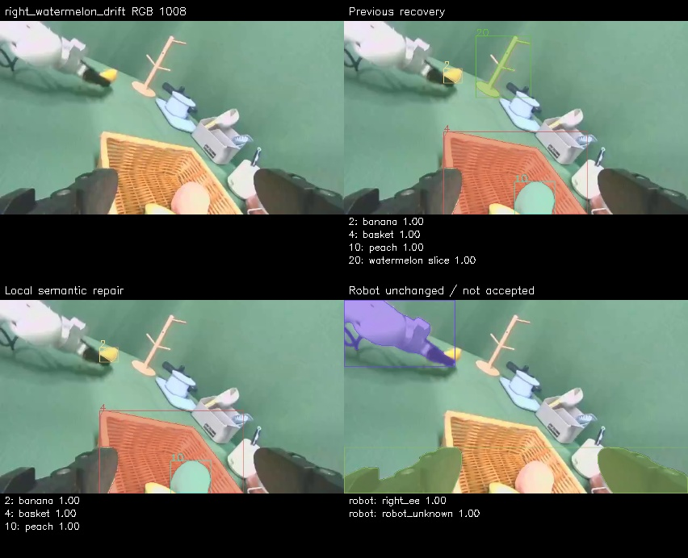

# 真实案例导览

离线查看所有新渲染示例：下载/clone 后打开 [gallery/index.html](gallery/index.html)。此静态图库由 `example_check.py` 从随包真实 RGB/RLE 重建，无需部署服务；也可自行运行该脚本复核。

## 1. 人工确认是精确范围

`confirmed_audit/` 包含原 UI 序号 61、143、242 的三张图、共 15 个标签。PNG 和标签逐字节拷贝，来源哈希在 SOURCE_SNAPSHOT.json。history 中的 420 总量是原项目，交接只取这三张作示例。每个标签保留 annotation_method、prediction_prefill、human_confirmed 和 source image hash。

源 manifest 的旧队列状态 PENDING_HUMAN 不覆盖实际已确认 label 文件。复用时以按图像 hash 绑定的当前标签/导入记录为准，不能机械按一个旧字段要求用户重做全部确认。

## 2. 连续短片段与真实帧映射

- `kettle_wrist/`：C001，task1 episode001608，right_wrist，source146–153；seed 为 source150/local4，精确 seed 为已确认 mask。传播出的其他 source frames 不因此成为 human GT。
- `fruit_reentry/`：C050，task24 episode002563，right_wrist，source315–322；来源于局部修复后的 release。篮子、西瓜、牛油果 seed 是 assistant-reviewed pseudo-labels，不是新的人工像素标注。香蕉/桃子等未决保持 unknown；robot 独立保存。

示例名称 fruit_reentry 指其来源的重入画修复案例；这 8 帧本身不覆盖完整 reentry 事件，不能凭这个子片段计算恢复成功率。

两者均保存原图、source/local frame、实际 timestamp、object/robot JSONL、原 release frame counts 与 review 决策。gallery 下方的 ROI/known 由 `training_eligible` 和明确 unresolved 清单重建，检查计数与 source release 相同。

## 3. 失败和局部修复

原 task24 episode002503：右上旧结果把杯架标成 object20 西瓜，SAM confidence 仍约为 1；左下停止该错误 track，保留其他对象；右下 robot 层未改，也没有因此被验收。UNKNOWN 停止可能牺牲覆盖，不能当作整段确认没有西瓜。

其他图：head banana 的 15/547 帧显示稀疏 seed 后远端检查；right banana 668/748 显示遮挡残影与重新可见后的局部修复。附带原点框、正负点、seed RLE 和 source image hash。它们属于已反复查看的开发案例，不是独立准确率样本。

这些图用于学习“看原图与上下文→识别漂移→局部修复→复查接缝”的办法，不复制旧 frame 区间和提示坐标到新场景。
